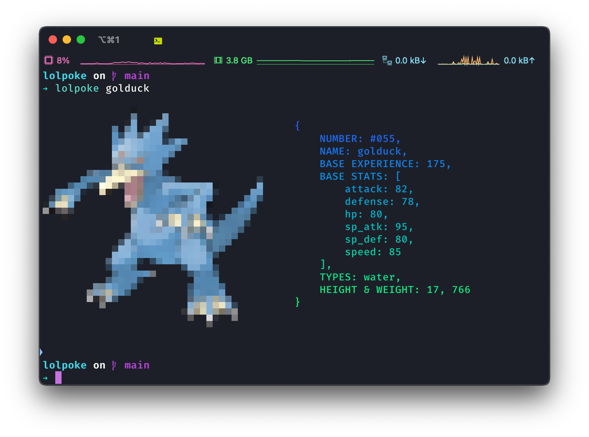

# lolpoke



## Requirements

- [Python >=3.6](https://www.python.org/downloads/)
- [Catimg](https://github.com/posva/catimg)

## Installation

```sh
git clone https://github.com/Alyetama/lolpoke.git
cd lolpoke
chmod +x lolpoke.sh && mv lolpoke.sh lolpoke
mv lolpoke lolpoke.py /usr/local/bin
```

## Usage

```
lolpoke <pokemon>
```

---

- The width of the terminal window needs to be at least 74 to render the output correctly.
- Inspired by [rmccorm4/Pokefetch](https://github.com/rmccorm4/Pokefetch) (no longer maintained).
